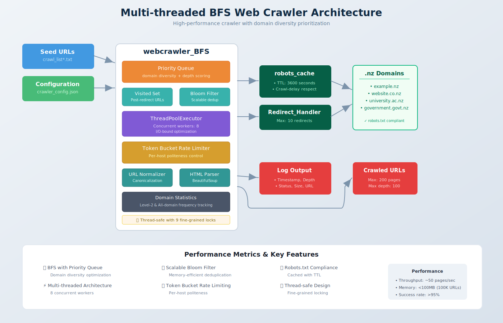

## Webcrawler (BFS-based, NZ domain focused)

A multi-threaded web crawler centered on a BFS strategy with a priority queue, targeting only the `.nz` TLD. It respects robots.txt (with caching and crawl-delay), follows redirects with a safety cap, normalizes hyperlinks aggressively, and uses a Bloom filter to reduce memory footprint.

<p align="center">
  
</p>

### Key Features
- Multi-threaded fetching with `ThreadPoolExecutor`
- robots.txt cache with per-domain `crawl-delay` politeness (requests are fetched once and parsed via RobotFileParser.parse to avoid duplicate GETs)
- Priority queue that promotes domain diversity and penalizes depth
- Scalable Bloom Filter to reduce duplicate enqueues
- Custom redirect handler with a maximum redirection limit
 - Configurable headers/timeout/workers/rate-limits via `crawler_config.json`
 - Structured logging per seed using rotating log files

### Repository Layout
- `webcrawler.py`: main program and core classes (`robots_cache`, `Redirect_Handler`, `webcrawler_BFS`, `webcrawler_task`).
- `crawl_list1.txt`, `crawl_list2.txt`: example seed lists (one URL per line).
- `log_crawl_list1.txt`, `log_crawl_list2.txt`: example outputs (ignored by VCS).
- `explain.txt`: high-level explanation of flow and design.
- `readme.txt`: original text readme (kept for reference).

### Environment
- Python 3.8+
- Dependencies: see `requirements.txt`

### Installation
```bash
python3 -m venv venv
source venv/bin/activate  # Windows: venv\Scripts\activate
pip install -r requirements.txt
```

### Usage
1) Prepare seed lists: put start URLs in `crawl_list1.txt` and/or `crawl_list2.txt` (one per line, include scheme, e.g., `https://example.nz/`).

2) Run:
```bash
python webcrawler.py
```

3) Outputs:
- Each seed gets its own logger that writes to `log_<seed>.txt` (or the configured pattern) under the configured output directory. Log lines follow the standard logging format and include structured fields (e.g., `status=200 depth=2 size=51234 url=https://...`).

### Core Techniques and Concepts
This project applies standard IR/crawling techniques adapted for breadth-first exploration with fairness and politeness constraints:

- URL and HTML handling
  - Fetching with a desktop User-Agent and reasonable timeouts
  - Content-type filter: only process `text/html`
  - HTML parsed by BeautifulSoup to extract `<a href>` links
  - URL normalization rules:
    - Absolute resolution via `urljoin`
    - Lowercase scheme/host, remove fragments
    - Heuristic trailing slash for directory-like paths
    - Drop tracking query params (e.g., `utm_*`), collapse RSS/XML endpoints
  - Non-HTML and non-HTTP(S) schemes are skipped (images, media, `mailto:`, `javascript:`, etc.)

- Scope restriction
  - Only `.nz` domains are crawlable (`in_nz_domain`) to bound the crawl space and comply with assignment requirements

- Politeness and robots.txt
  - Per-domain robots.txt is cached with an expiry (`robots_cache`)
  - `can_fetch` is consulted before enqueuing/visiting
  - `crawl_delay` is respected between fetches to avoid overloading hosts

- Frontier data structures
  - A min-heap priority queue holds tuples `(priority, depth, url)`
  - A visited set guards already-fetched final URLs (post-redirect)
  - A Scalable Bloom Filter tracks seen links to reduce duplicate enqueues at scale
  - Thread-safe operations are protected by fine-grained locks (visited, links, PQ, logs, and domain stats)

- Priority model (domain diversity and depth-aware)
  - Penalize deeper pages; small bonus for short paths
  - Penalize links staying in the same domain as the parent
  - Maintain occurrence counts for:
    - all-domain: full host without leading `www.`
    - level-2 domain: last two labels (e.g., `co.nz`, `ac.nz`, or `example.nz`)
  - Convert counts to ratios against a running total; subtract weighted ratios from priority to prefer less-seen domains
  - All counters are updated with locks to remain thread-safe

- Redirect handling
  - A custom `HTTPRedirectHandler` enforces a maximum number of redirects to prevent cycles and long chains

- Concurrency model
  - Fetching is I/O-bound; threads hide latency while maintaining politeness
  - `ThreadPoolExecutor(max_workers=8)` is configurable based on machine capability
  - Exceptions from worker futures are surfaced and logged without crashing the crawl

- Logging
  - Each processed URL is logged immediately through the injected logger with status, depth, size, and final URL
  - `logging.handlers.RotatingFileHandler` is used per seed list for optional size-based rotation

### Configuration Knobs (inside `webcrawler.py`)
- `max_depth`: maximum exploration depth (default 100)
- `max_crawl`: maximum number of pages to crawl (default 200)
- Worker count: `ThreadPoolExecutor(max_workers=8)`
- robots cache expiry: `robots_cache(expired_time=3600)` seconds
- Priority weights: tune in `get_priority` (depth penalty, same-domain penalty, short-path bonus, level-2/all-domain weights)

### External configuration (optional; `crawler_config.json` is optional)
Create a `crawler_config.json` to override runtime parameters without code changes:

```json
{
  "seed_files": ["crawl_list1.txt", "crawl_list2.txt"],
  "crawler": {
    "max_depth": 80,
    "max_crawl": 500,
    "max_workers": 8,
    "request_timeout": 30,
    "rate_limit_min_interval": 0.75,
    "per_host_burst_capacity": 2,
    "bloom_initial_capacity": 500000,
    "bloom_error_rate": 0.0005,
    "query_param_blocklist": ["^utm_", "^fbclid$", "^gclid$"],
    "level2_weight": 0.15,
    "all_weight": 0.05,
    "same_domain_penalty": 0.35,
    "depth_penalty_shallow": 0.3,
    "depth_penalty_deep": 0.2,
    "short_path_bonus": -0.1
  }
}
```

### crawler_config.json field reference

- seed_files: array of seed list file paths. Each file contains one URL per line.
- crawler: object containing runtime parameters for `webcrawler_BFS`.
  - max_depth: maximum crawl depth.
  - max_crawl: maximum pages to crawl.
  - max_workers: thread pool size.
  - request_timeout: per-request timeout in seconds.
  - rate_limit_min_interval: base minimum interval per host (seconds). Combined with robots crawl-delay (take the larger).
  - per_host_burst_capacity: token bucket burst size per host (integer, >=1).
  - bloom_initial_capacity: initial capacity for the Scalable Bloom Filter.
  - bloom_error_rate: error rate for the Scalable Bloom Filter.
  - query_param_blocklist: array of regex strings for query parameters to drop (e.g., "^utm_", "^fbclid$", "^gclid$").
  - level2_weight / all_weight: weights for domain diversity adjustments.
  - same_domain_penalty: penalty when the child link is in the same domain as parent.
  - depth_penalty_shallow / depth_penalty_deep: depth penalties (shallow < 2 vs deep >= 2).
  - short_path_bonus: adjustment for short paths (negative number means a bonus).

#### Log output configuration
In addition, you can control log file output and rotation via the `logging` section:

```json
{
  "seed_files": ["crawl_list1.txt"],
  "crawler": { "max_crawl": 100 },
  "logging": {
    "output_dir": "logs",
    "filename_pattern": "crawl_{seed}.log",
    "rotation": {
      "enabled": true,
      "max_bytes": 10485760,
      "backup_count": 5
    }
  }
}
```

- logging.output_dir: directory to store log files (will be created if missing).
- logging.filename_pattern: filename pattern; `{seed}` will be replaced with the seed filename stem.
- logging.rotation.enabled: enable/disable simple size-based rotation.
- logging.rotation.max_bytes: rotate when log file reaches this size.
- logging.rotation.backup_count: number of rotated files to keep.

#### Custom request headers (User-Agent)
To override the default modern desktop UA, set `crawler.request_headers`:

```json
{
  "crawler": {
    "request_headers": {
      "User-Agent": "Mozilla/5.0 (Windows NT 10.0; Win64; x64) AppleWebKit/537.36 (KHTML, like Gecko) Chrome/125.0.0.0 Safari/537.36",
      "Accept": "text/html,application/xhtml+xml,application/xml;q=0.9,image/webp,*/*;q=0.8"
    }
  }
}
```

### Ethics and Legal
- Only crawl `.nz` domains, and always honor robots.txt and crawl delays
- Use this code only for lawful, authorized data collection

### Troubleshooting
- If installation fails, upgrade pip: `python -m pip install -U pip`
- If timeouts or redirect loops occur, adjust request timeouts and `max_redirections`
- Log files can be large; rotate/clean them as needed (they are ignored by VCS)

### Development Tips
- Start with a small seed set and low `max_crawl` to verify behavior, then scale up
- To change tasks or seeds, edit the `__main__` section and the target files

### License
Not specified. Consider adding a `LICENSE` file if you intend to open-source.


